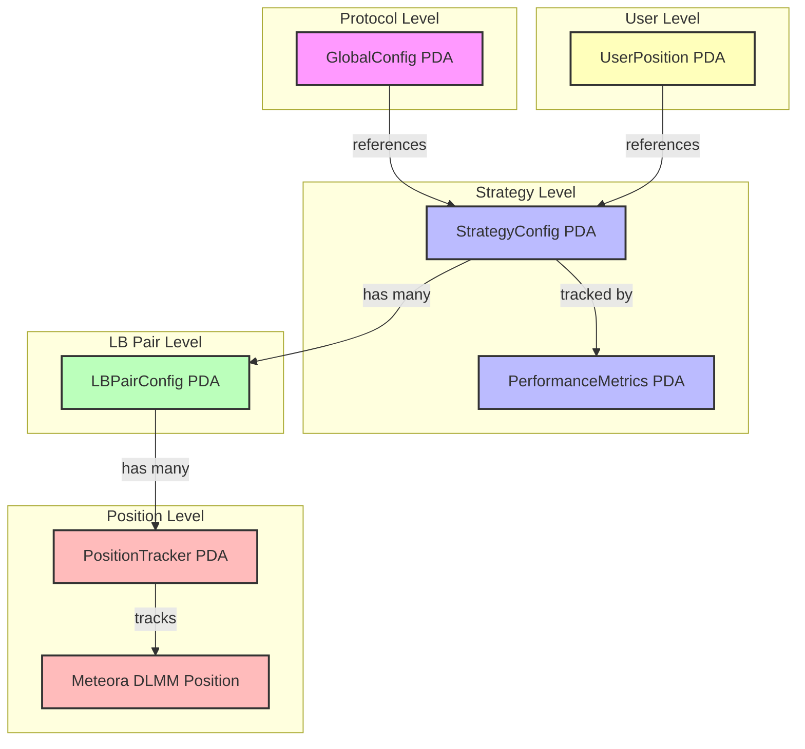
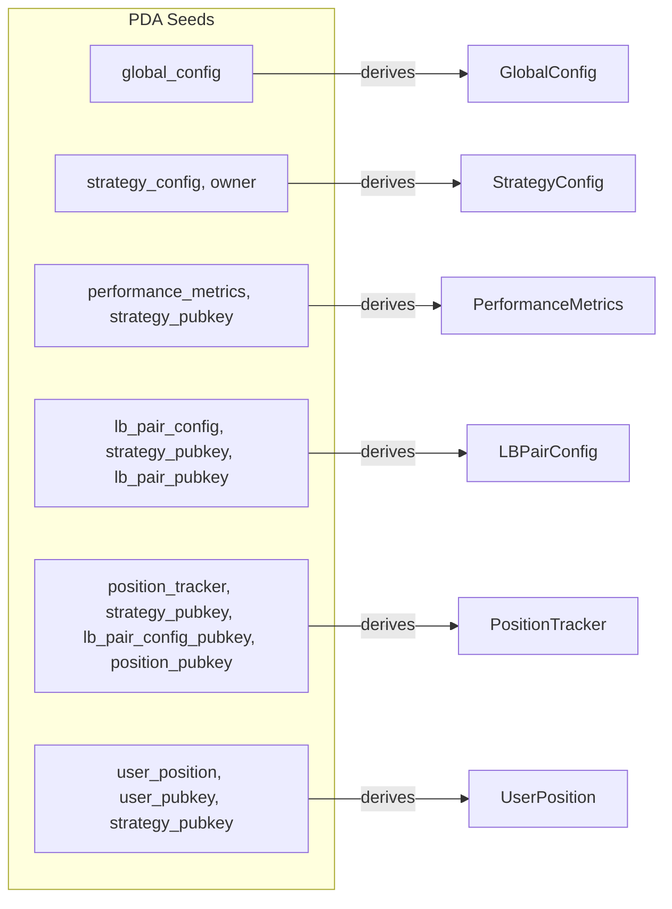
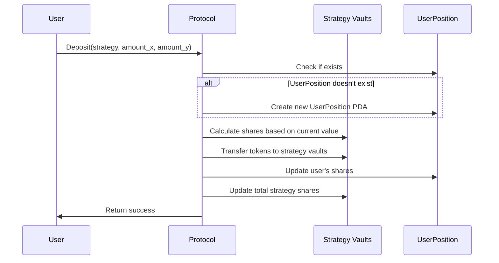
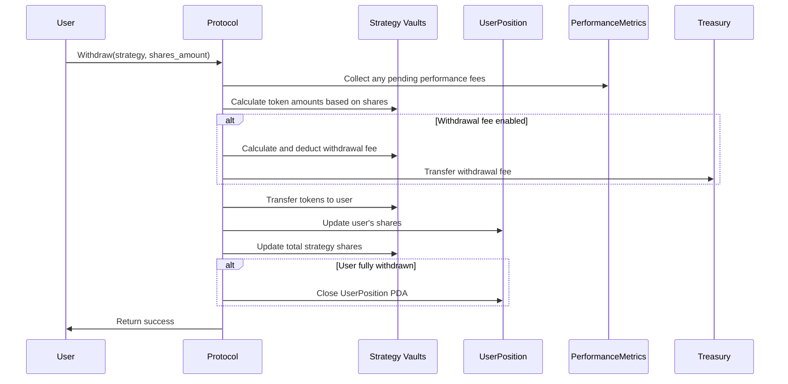
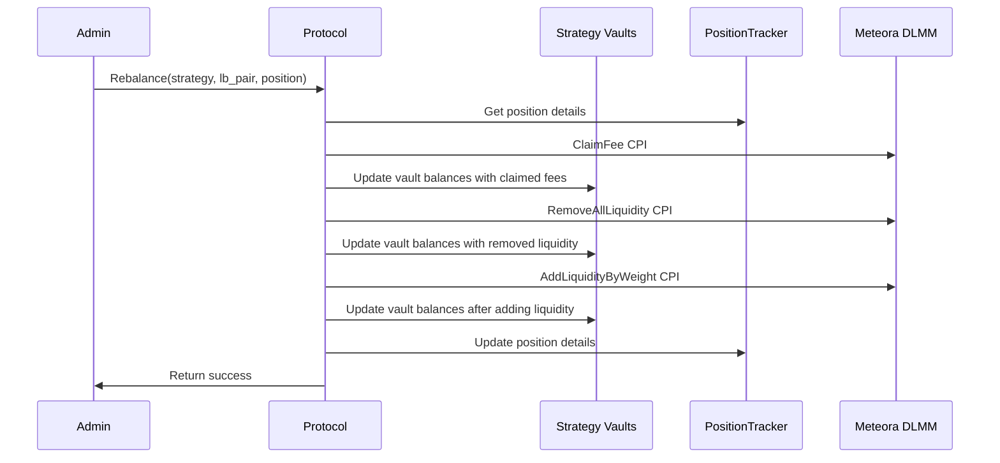
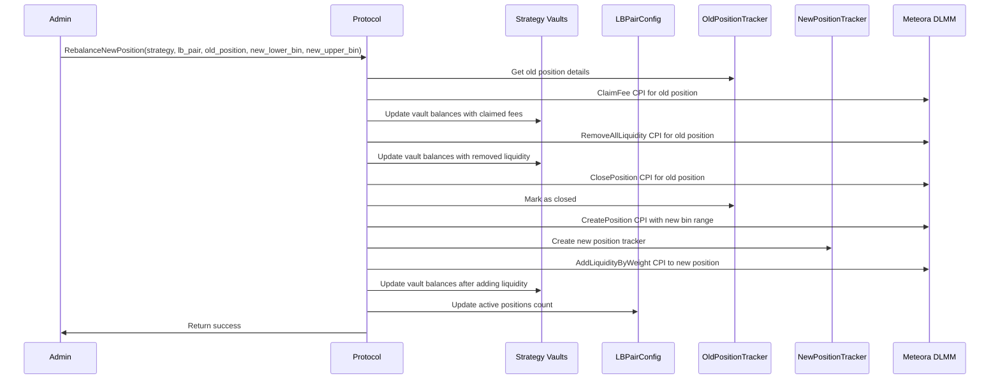
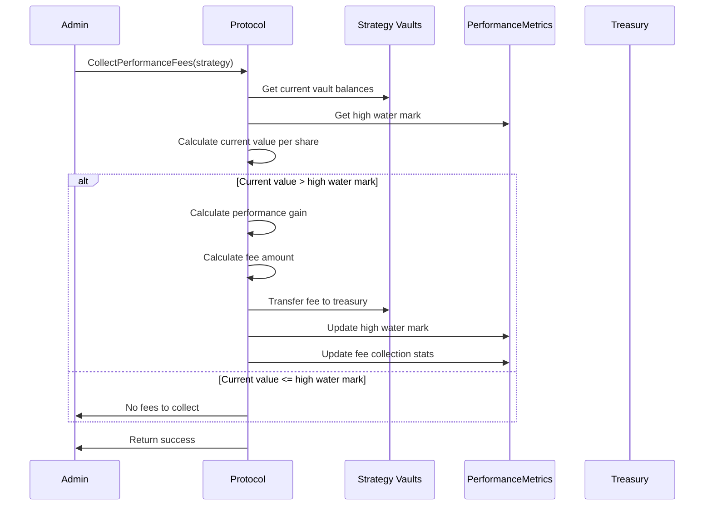
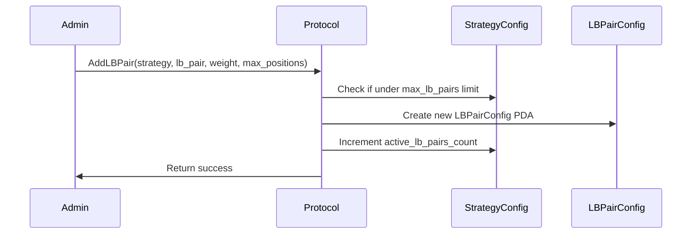
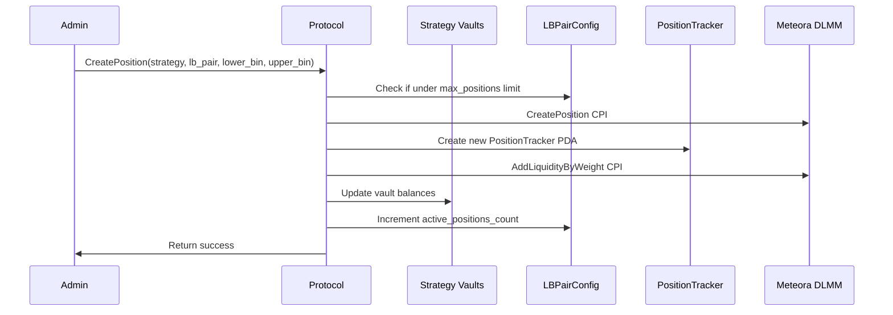

# System Diagrams

This document contains diagrams illustrating the account relationships and operational flows of the Meteora DLMM Position Management protocol.

## Account Relationships

## PDA Derivation

## User Flows

### Deposit Flow

### Withdraw Flow

## Admin Flows

### Rebalance Flow (Same Position)

### Rebalance Flow (New Position)

### Performance Fee Collection Flow

## Multi-Position Management Flows

### Add New LB Pair to Strategy

### Create Position in LB Pair
