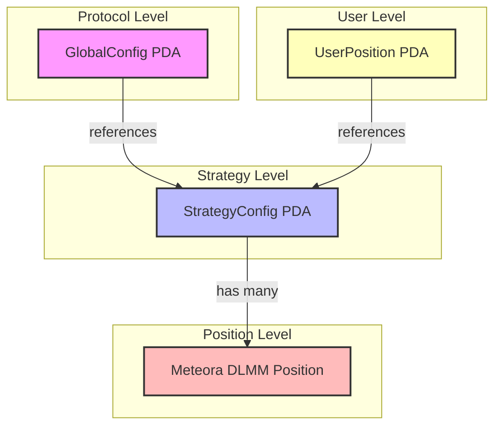
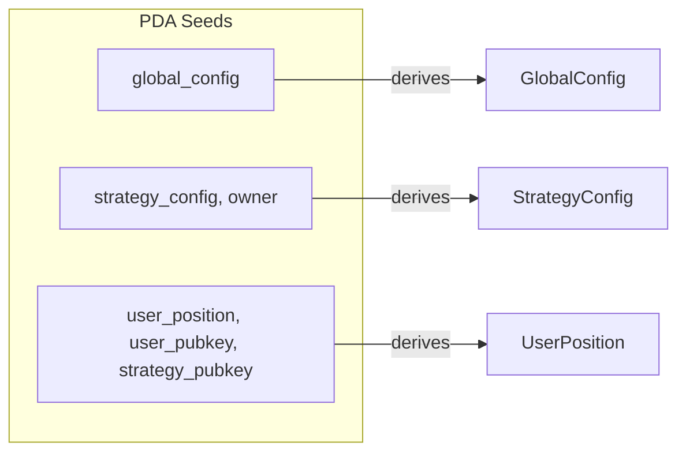
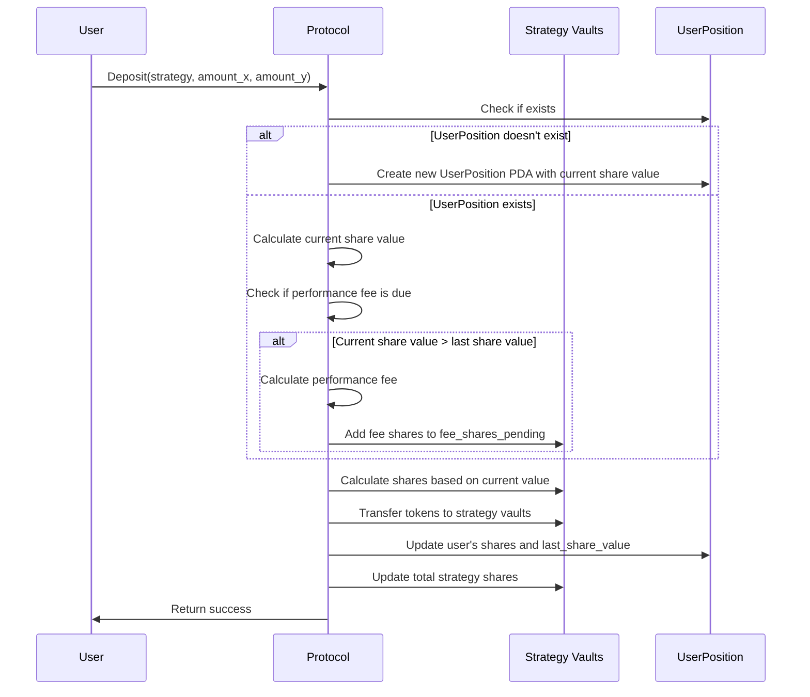
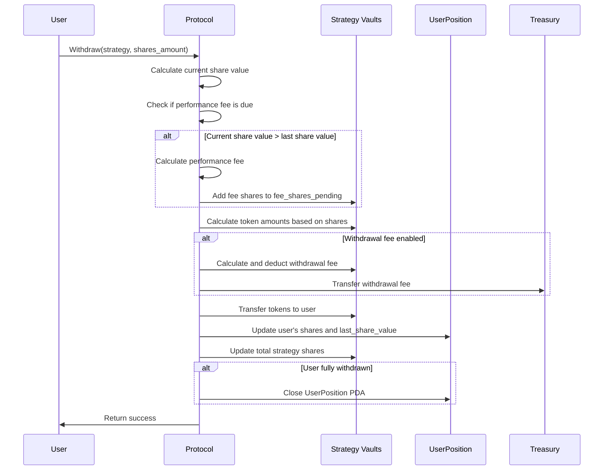
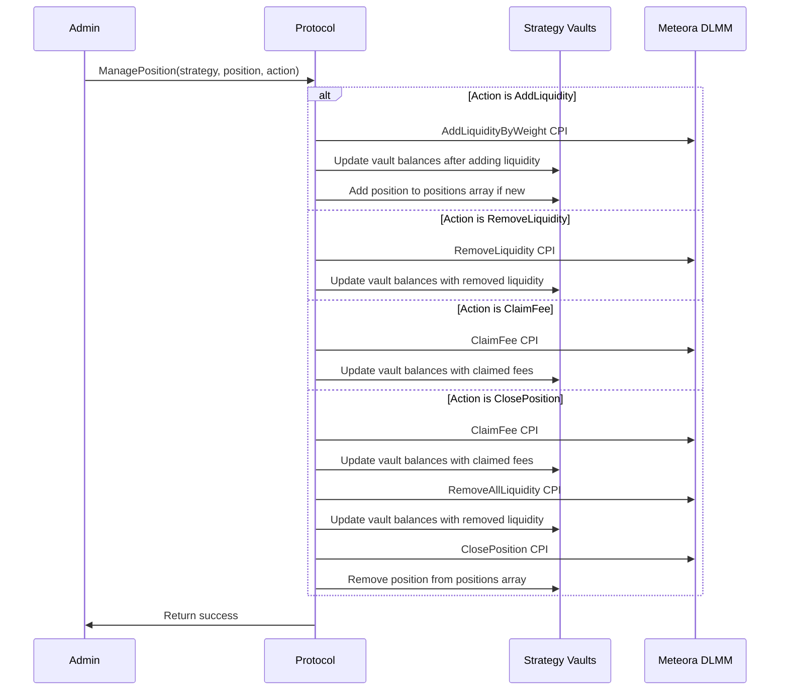
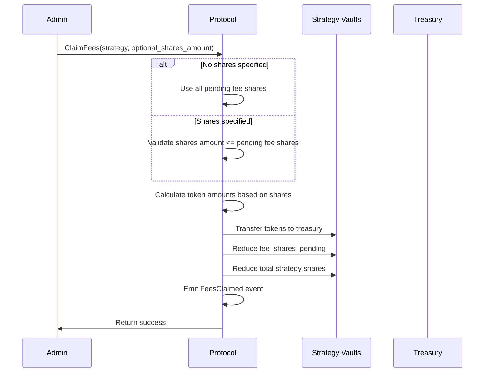
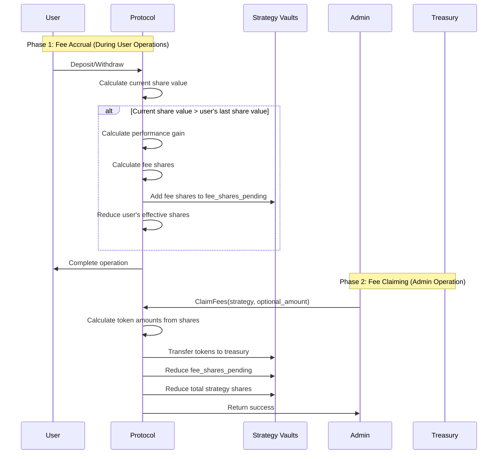
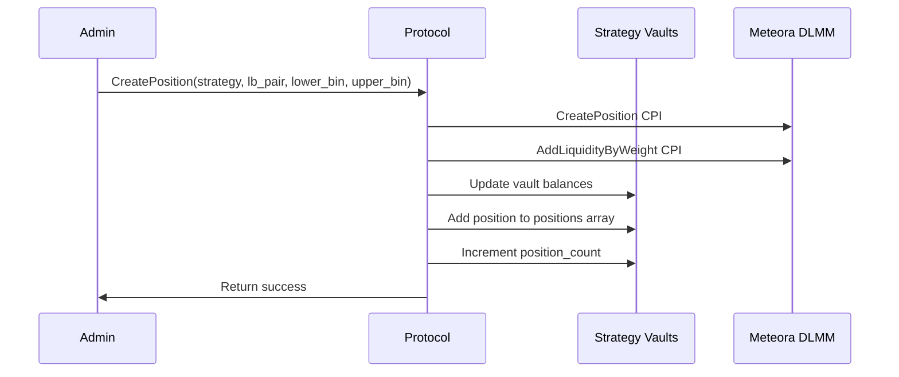
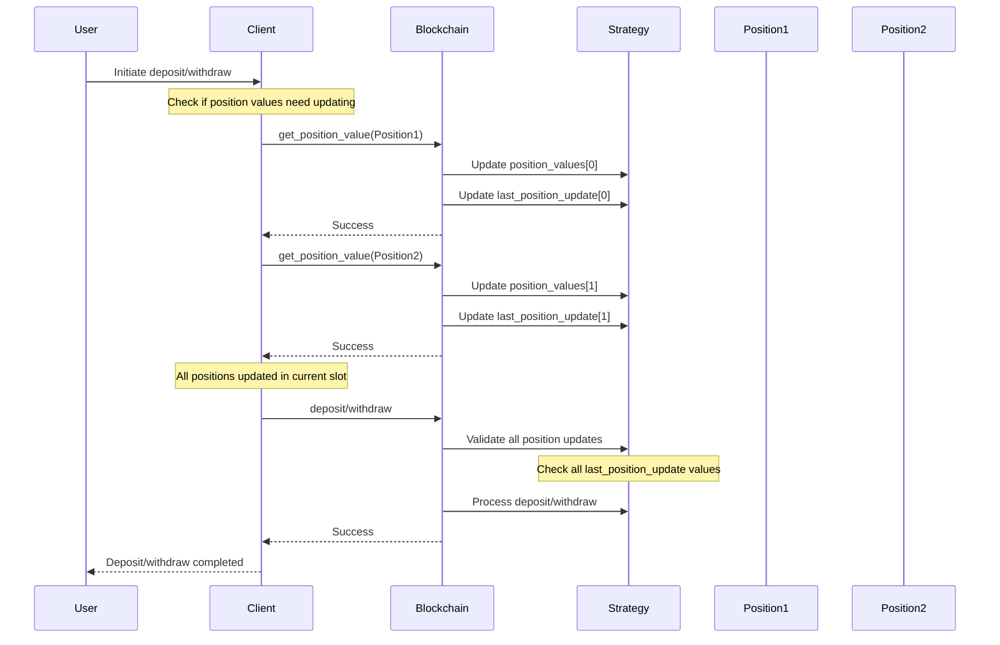

# System Diagrams

This document contains diagrams illustrating the account relationships and operational flows of the Meteora DLMM Position Management protocol.

## Account Relationships

## PDA Derivation

## User Flows

### Deposit Flow

### Withdraw Flow

## Admin Flows

### Position Management Flow

### Fee Claiming Flow

### Performance Fee Collection Process

## Create Position Flow

## Position Value Update Flow

The following diagram illustrates the client-side flow for updating position values before deposits or withdrawals:

### Client-Side Implementation Notes

1. **Position Value Update Process**:
   - Before initiating a deposit or withdrawal, the client must ensure all positions have up-to-date values
   - The client should call `get_position_value` for each position in the strategy
   - All these calls should be made within the same transaction as the deposit/withdraw instruction

2. **Transaction Building**:
   - Build a transaction with multiple instructions:
     - One `get_position_value` instruction for each position
     - The final deposit or withdraw instruction
   - This ensures all updates happen atomically with the deposit/withdraw

3. **Error Handling**:
   - If any position value update fails, the entire transaction will fail
   - If the deposit/withdraw validation fails due to stale values, the client should retry the entire process

4. **Optimization**:
   - For strategies with many positions, the client may need to batch updates across multiple transactions
   - In this case, the deposit/withdraw should be in the final transaction after all updates are complete

This design ensures that all position values are fresh when deposits or withdrawals occur, maintaining fair value calculations for all users.