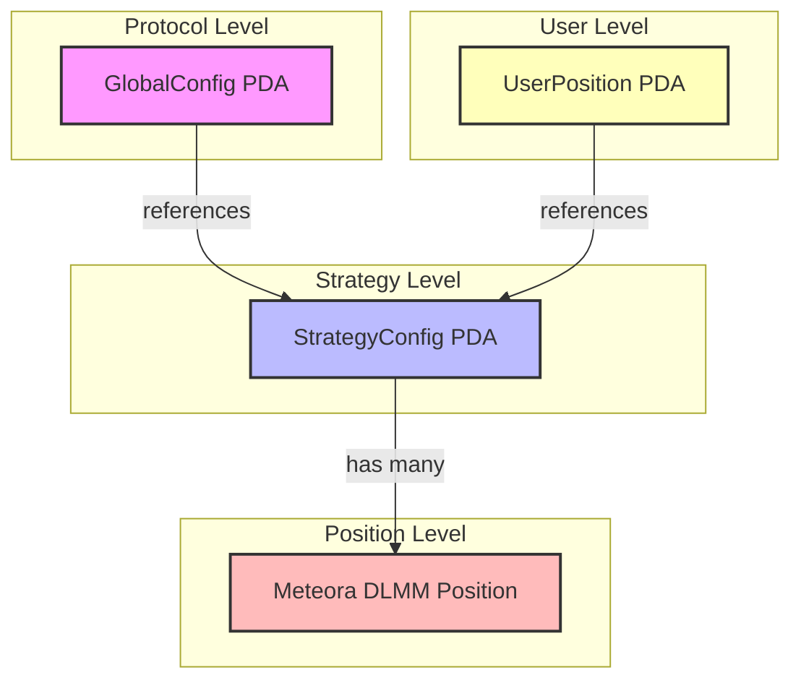
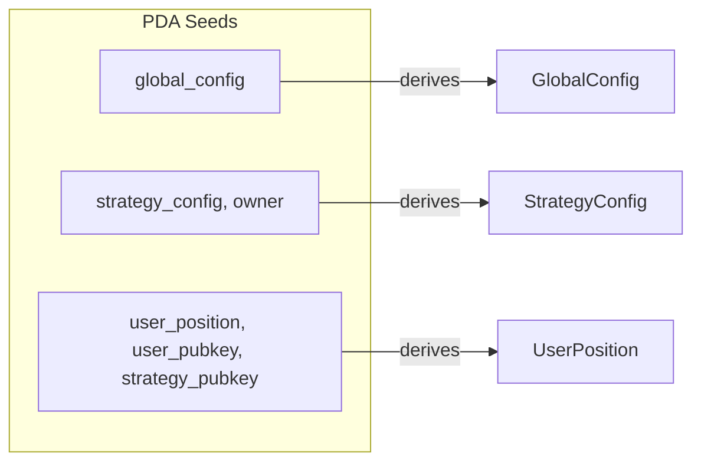
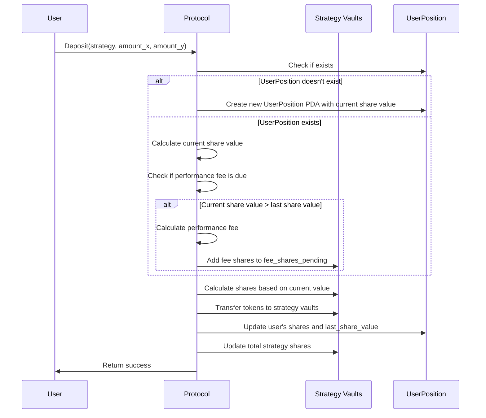
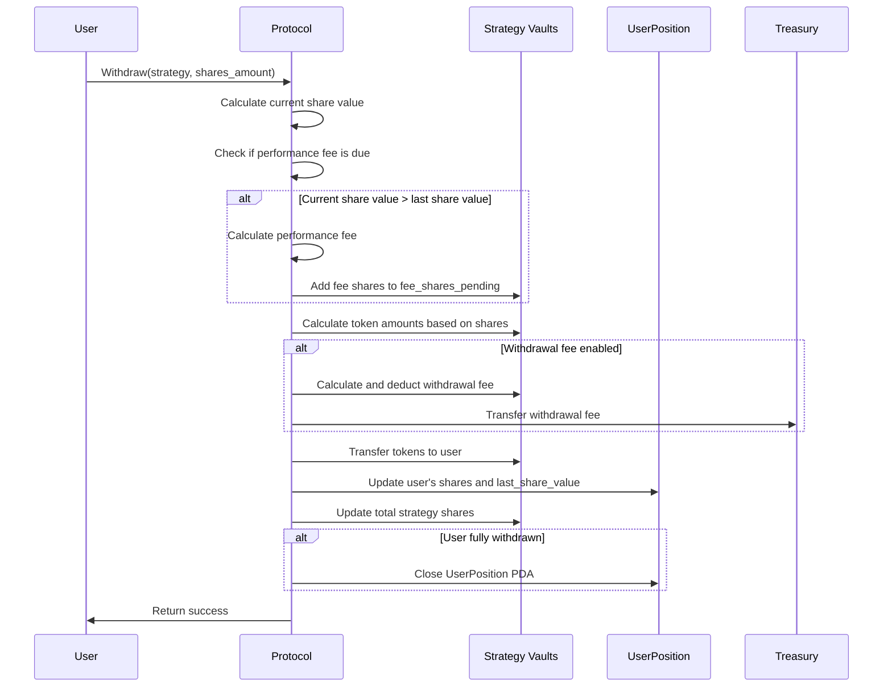
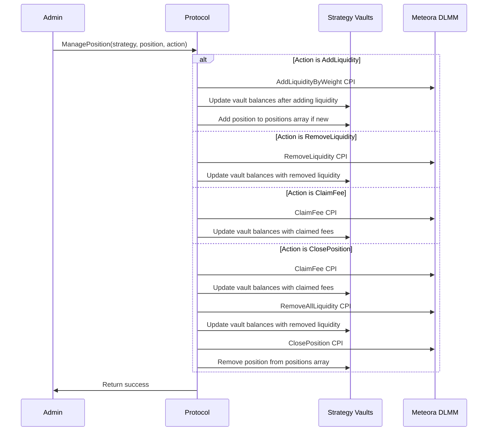
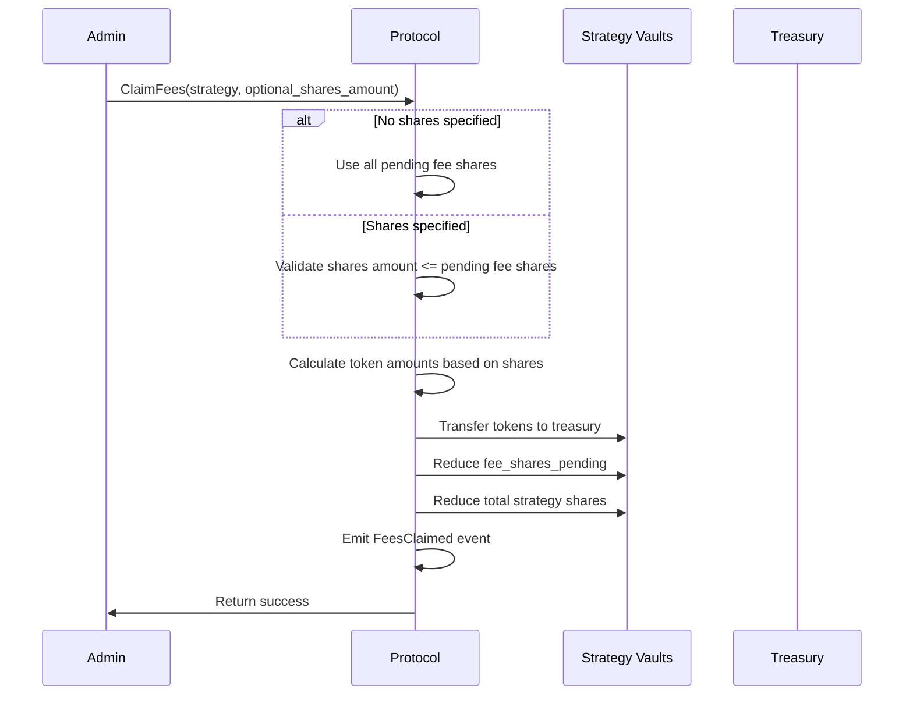
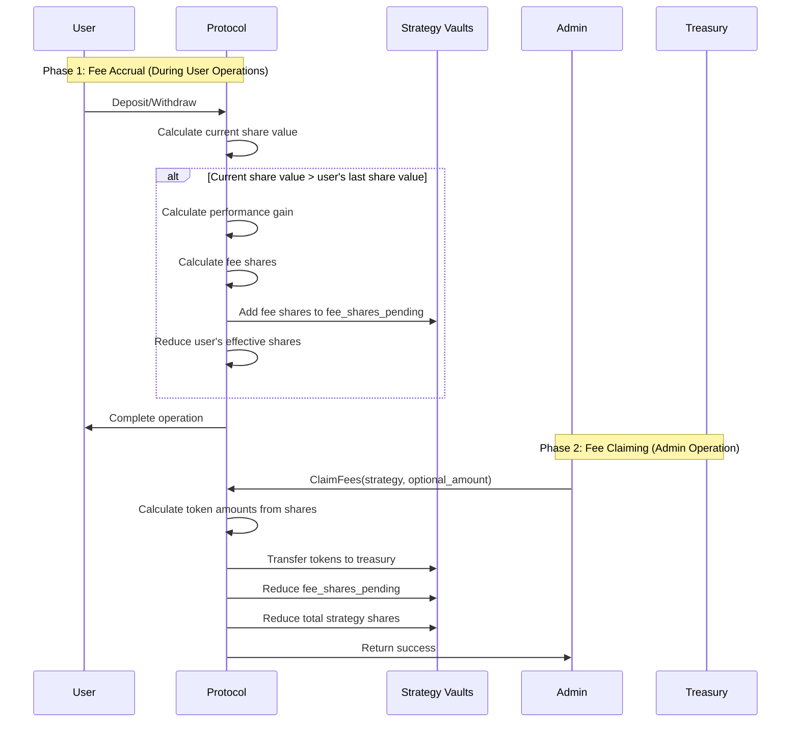
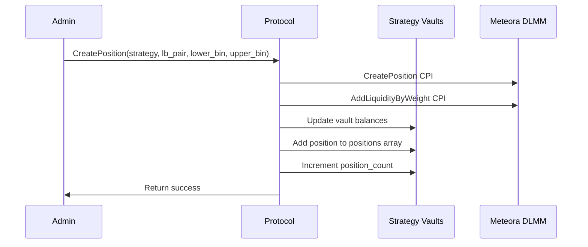

# System Diagrams

This document contains diagrams illustrating the account relationships and operational flows of the Meteora DLMM Position Management protocol.

## Account Relationships

## PDA Derivation

## User Flows

### Deposit Flow

### Withdraw Flow

## Admin Flows

### Position Management Flow

### Fee Claiming Flow

### Performance Fee Collection Process

## Create Position Flow
